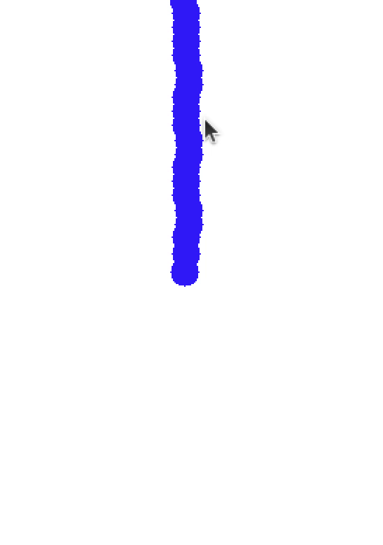
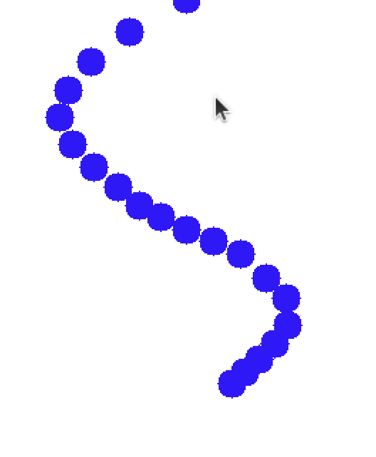
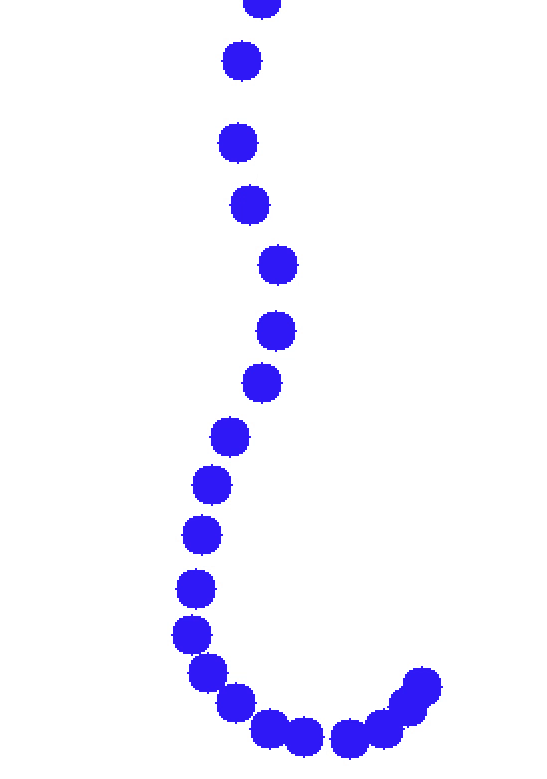

# Rope Simulation

## Introduction

The purpose of this project is to develop an FPGA synthesizable program capable of simulating ropes movement via verlet integration. The stack of the project is as follows:
 
- **Hardware**: FPGA
- **Simulation**: Verilator 
- **HDL**: Verilog

## Docs
The ADM and FSM diagarm are the main resources and idea for the implementation of the project. You can find them in the docs folder.

## Showcase

1. Rope connected to a fixed point

2. Rope enters the tension state

3. Rope enters the whipcrack state

